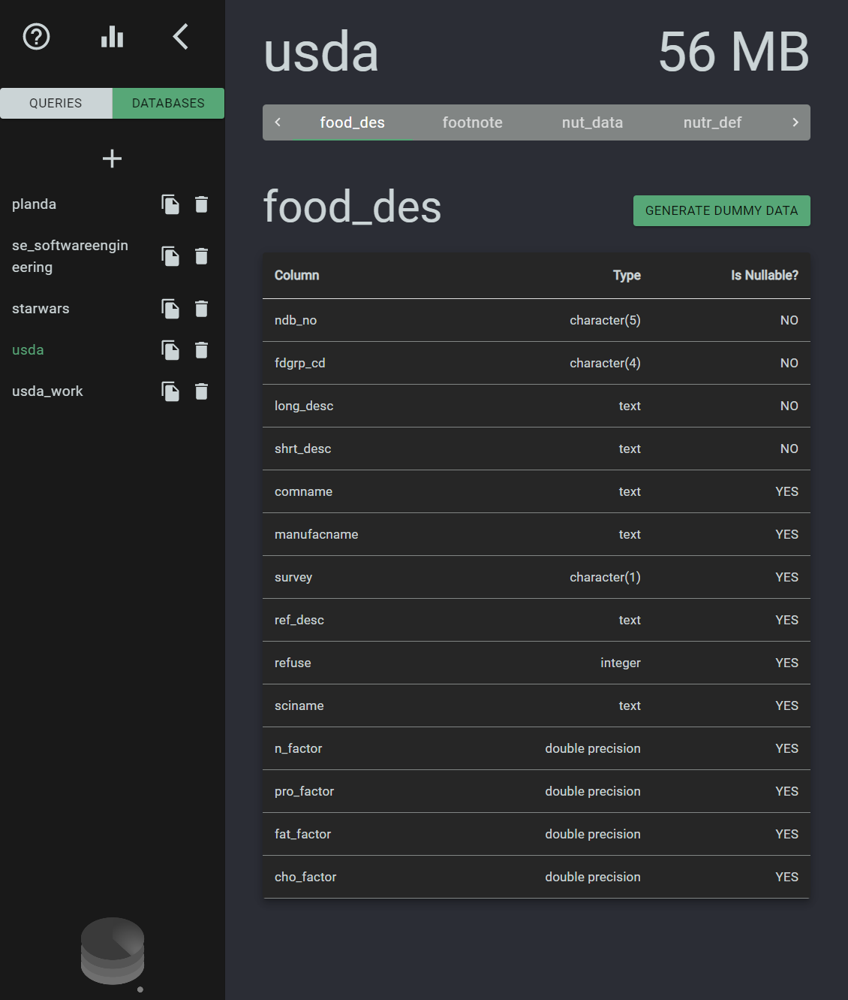
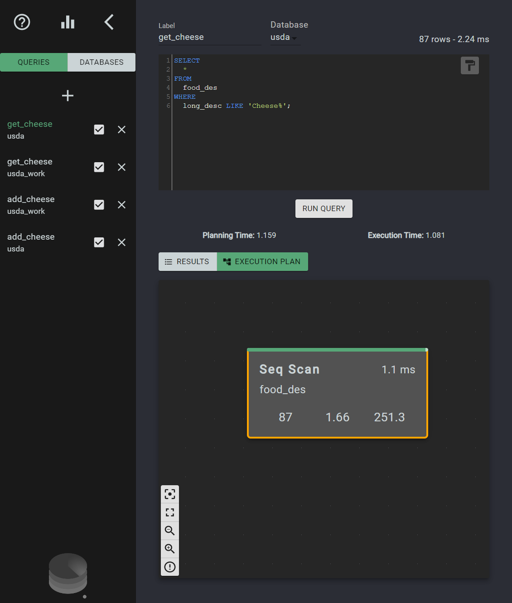
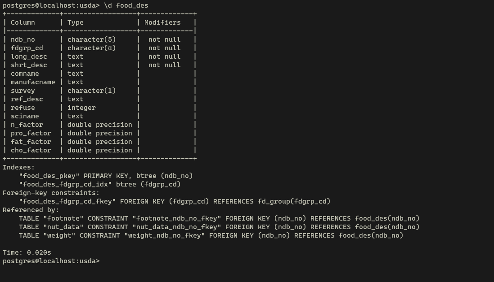
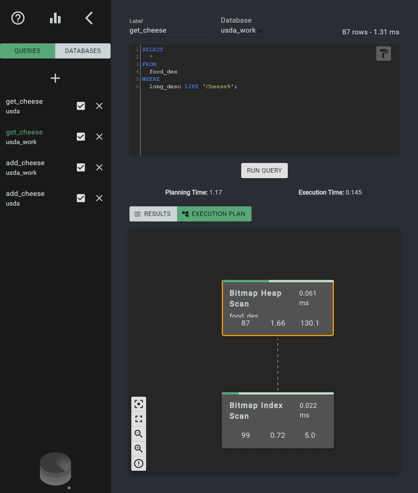
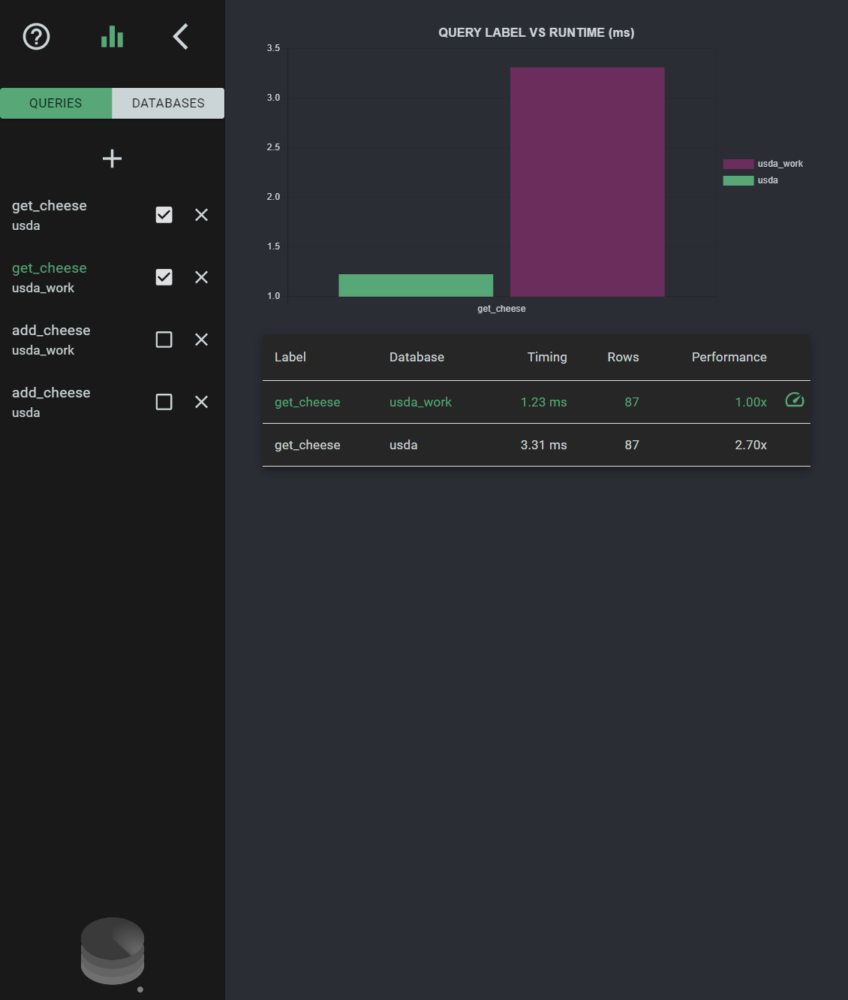
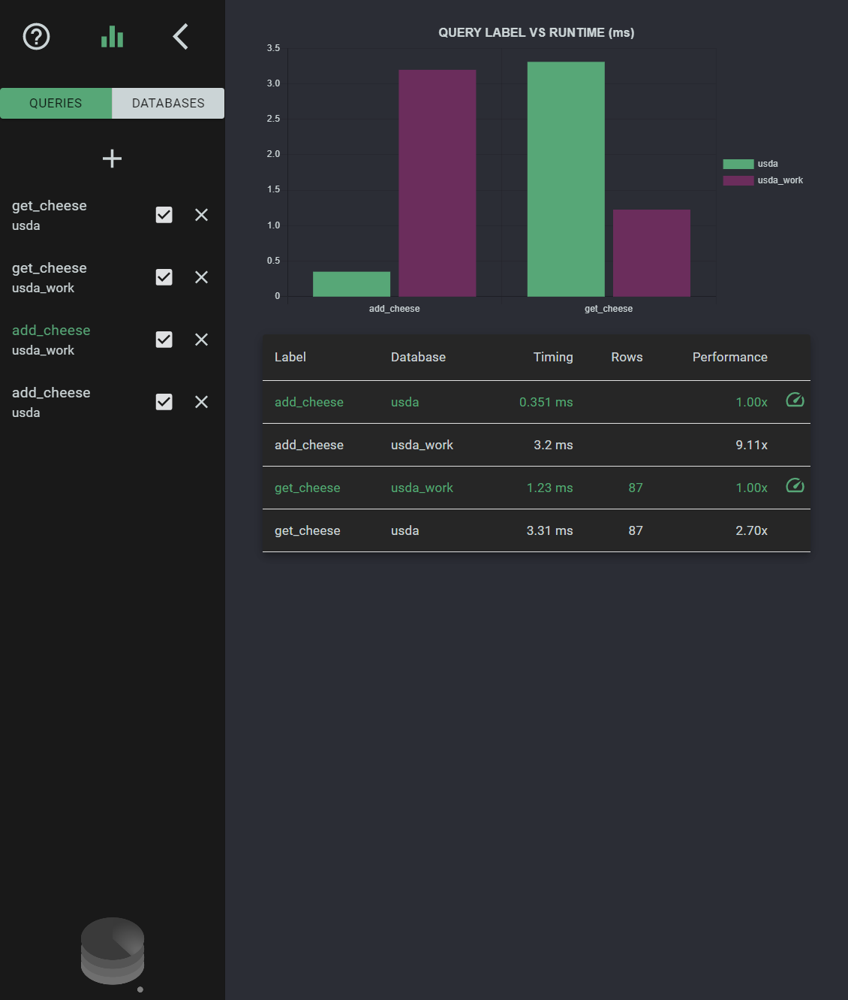

# PostgreSQL optimization through indexing

In the age of Big Data, Machine Learning, User Data Privacy, and other big tech words it's easy to forget that this data often lives inside databases. When we scroll through a shopping website a server is sending requests to a database that stores millions, if not billions of records. And as far as we as users are concerned, the data must be immediately available.

Good thing there are many solutions to that problem, all of which are dependant on the specific needs of the project and the technologies available for the development team. For example, Apps make use of Caches and other fast-retrieval strategies for often-accessed data, and multiple databases can work in tandem to exercise their strengths. We wouldn't get anywhere if we tried to think of all possible solutions to the optimization problem in this article. Also, I have no intention of boring you to that extent anyway, so we'll jump straight into a couple of assumptions:

- Out of all storage and database solutions, we are going to focus on **SQL** databases.
- More specifically, we will work with a **PostgreSQL** database.

## How is a query executed by PostgreSQL?

When PostgreSQL receives a query from a client it doesn't immediately start going through your tables and records. First a _planner_ will analyze the query and determine the best plan of execution to retrieve the information that was requested. The more complex the query is, the more options the _planner_ has when determining the order in which tables will be accessed and which operations will be performed in each step in order to finish the operation as efficiently as possible.

The _planner_ is an integral part of how a SQL database works. It makes use of the information it has about all tables in the database and statistics about their row makeup to determine the best plan of action. It has the freedom to do so because SQL is a _declarative_ language that doesn't concern itself with telling the database **HOW** to do things. It determines **WHAT** needs to be done.

When we write

```sql
SELECT name, address FROM users WHERE age > 50 LIMIT 100;
```

We are describing what we want the result to be. In this case, it's the same as saying: "Give me the name and address of up to 100 users that are above the age of 50". Notice that we didn't describe what kind of algorithm it should use to traverse the tables, or how to check for the age, or in which order to make these checks. This allows the _planner_ to design an optimal retrieval strategy.

The key part to pay attention to is the fact that the planner needs to have information about the tables and their data to work effectively. If all it has to work with are tables filled with columns that it knows nothing about, populated by an unknown number of rows in an unspecified order, well, there's not much it can do and it'll probably resort to reading the entire table row by row.

It's our job as developers to provide the planner with "better" information about our data so it can most effectively help us by designing optimal execution plans. And one of the most basic ways we can do that is using **indexes**.

## What are indexes

Let's start with a trivial example. Suppose we are working with a table of players such as:

```sql
CREATE TABLE players (
  id INT,
  username VARCHAR
);
```

If a common query in our application is to retrieve a player by their id:

```sql
SELECT username FROM players WHERE id = [requested id];
```

Every time the database looks for a player, it will scan the entire table until it finds a player whose id equals `[requested id]`. If the player ids were guaranteed to be unique and the database had access to an ordered list of ids, it could devise a much better plan to find the specified id. Depending on how that list is structured, different search algorithms could be used that would guarantee a faster lookup speed than linear time. In essence, this is what indexing is all about.

We can create a simple index with the following query:

```sql
CREATE INDEX players_id_index ON players (id);
```

PostgreSQL creates B-tree indexes by default. B-trees are balanced tree data structures that have a logarithmic lookup time. When dealing with small tables the difference between searching through the index or the table won't be very noticeable. In fact, PostgreSQL won't use an index during lookup unless the table has enough records to justify the overhead of reading the index and then retrieving the rows separately.

If we compared lookup steps for a linear scan with a theoretical B-tree index we would see numbers like below:

| Total Rows | Table Scan Column | B-tree |
| ---------- | ----------------- | ------ |
| 128        | 128               | 7      |
| 1024       | 1024              | 10     |
| 32768      | 32768             | 15     |
| 1073741824 | 1073741824        | 30     |

The performance improvement is significant, particularly as the number of rows grows. PostgreSQL implementation of the B-tree structure is more complex than this example, but the order of magnitude of the improvements gives us an idea of why such a structure would improve our SELECT queries.

If Indexes are so great, why isn't every column indexed by default?

Well, an index is only useful if it's kept up to date with the data in the table that actually holds the information. And updating an index is expensive since for every write operation (INSERT, UPDATE, DELETE) on the table all of its indexes will also need to be updated. The cost of updating an index is not as steep as the cost of looking up data sequentially but it becomes significant when many columns are indexed or write operations are frequent.

Indexing is a very powerful tool but it comes with its trade-offs. It's up to the developer to determine where indexes will be useful to the application and where they will become bottlenecks.

## How to identify indexing opportunities

For this example we'll use a sample database with USDA food information. The .sql file to create and populate the database can be downloaded from [here](https://github.com/morenoh149/postgresDBSamples). We'll also be using [SeeQR](https://www.theseeqr.io/), an open source PostgreSQL analytics tool that I've recently been contributing to. If you'd like to follow along the examples you should have:

- PostgreSQL installed with psql available in your PATH
- the usda sample database imported into your local PostgreSQL server
- SeeQR

Let's imagine we are building an application that retrieves data from the usda database and allows a user to search the records by the food description. We can see that the usda database has a table called **food_des** which contains a **long_desc** column. That's the column our application will query when searching for a particular item.



If we wanted to get all food items for which the description started with _'Cheese'_ we could query the database with the following query:

```sql
SELECT * FROM food_des WHERE long_desc LIKE 'Cheese%';
```

If we run that query in SeeQR and take a look at it's execution plan we'll notice that it has a single node with the type **Seq Scan**. That means the database is scanning through the entire table in order to find all records that satisfy our _WHERE_ condition. This table is not very large so the actual execution time is still minimal (this will depend on your system hardware and load when running this test). But if querying this information is the core functionality of our app, we most certainly would want to improve on this.



First of all, we can check which indexes are already set for this table using `psql`. If you run the following command, you'll notice we don't currently have an index that includes the **long_desc** column:

```shell
\d food_des
```



As we saw, an index might allow us to significantly speed up the execution of this query. In order to test our theory, let's first create a working copy of our **usda** database that we can modify. We will use this copy to compare execution times with an index against our **usda** database.

We can now create an index for the **long_desc** column and run the same query.

```sql
CREATE INDEX fooddes_longdesc_index ON food_des (long_desc);
```



You'll notice there are two nodes in the Execution Plan tree now: a Bitmap Index Scan ad a Bitmap Heap Scan. The first will search the index we created for strings that start with 'Cheese' and the second will retrieve those rows from the table.

If you jump to the comparison view in Seeqr we can easily compare the performances of each query side by side.



In this particular run, the indexed version ran around 2.7 times faster than the original non-indexed one. That might not sound like a lot, but as our app grows and this table is populated with more records this difference would become more apparent and significant.

Does that mean we should add an index to the production database? Well, that depends on how often we need to write to it. If we follow the same steps to test an insert query on each table in our databases, we'll notice that the insert time rises drastically:



That's where we need to think about the particular application we are working on and decide which queries are run most often, which are the most time-sensitive, and where our current bottlenecks are.

It's always a good idea to A/B test the performance of an application's queries when deciding to add/remove indexes. To help make that easier, I recommend using a database management tool, my current favorite being [SeeQr](https://www.theseeqr.io/).

Keep in mind that PostgreSQL has many other mechanisms for optimization that I am ignoring here. You might notice for example if you repeatedly run these queries while testing their execution time, the results may vary. That's because I am not taking caching into consideration since that would warrant an entirely different article. The tests here are aimed to give a rough estimate of the potential gains of indexing a column.

If you'd like to know more about SeeQR and contribute to it's development, visit it's repository in 
[github](https://github.com/open-source-labs/SeeQR). If you'd like more information about Indexes and the inner workings of PostgreSQL the https://www.postgresql.org/docs/current/ is a great place to start.

## Other tools worth checking out

- [pgcli](https://www.pgcli.com/) - psql alternative with autocomplete
- [pev](https://tatiyants.com/pev/#/plans) - online execution plan visualizer
- [Explain.dalibo.com](https://explain.dalibo.com/) - online execution plan visualizer

_Thanks to Cindy Chau for the editorial help and technical proof-reading_
