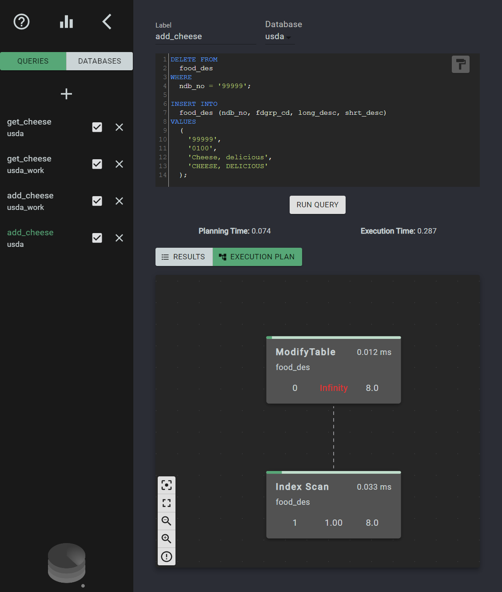

# PostgreSQL optimization through Indexing

In our current society, our digitial foodprint continues to grow larger and faster. Studies show that humans produce around 2.5 quintillion bytes of data every day. In the age of Big Data, Machine Learning, User Data Privacy and more, it's easy to forget that all of this data is stored somewhere- most likely in databases as single datapoints. When we invariably end up on StackOverflow while looking for a solution to a particularly sneaky bug, a server somewhere is sending requests to a database that stores this valuable inforation... the millions of comments, users, reviews, etc. And all of those requests need to be handled fast. Our generation is not used to waiting for information anymore and as far as users are concerned, the data is always immediately available.

That is a problem that has many solutions, all dependant on the specific needs of a project and the technology that is available for it's development team. Apps make use of Caches and other fast-retrieval strategies for often accessed data, and multiple databases can work in tandem to exercise their strengths. We wouldn't get anywhere if we tried to think of all possible solutions to the optimization problem in this article, and I have no intention of boring you to that extent anyway, so we'll jump straight into a couple of assumption:

- Out of all storage and database solutions, we are going to talk about **SQL** databases.
- More specifically, we are working with a **PostgreSQL** database.

Now that we have a manageable scope, let's dive in.

## How is a query executed by Postgres?

The first step in trying to get our queries to run faster is understanding how a query is executed by PostgreSQL. When we execute a SQL query in Postgres, it first parses the query, then the _planner_ decides on the best strategy to execute the given query. Once it determines what is a good **plan** it executes it and returns any rows/errors to the client.

The _planner_ is an integral part of how a SQL database works. It's main purpose is to use all the statistics it has available about the tables and their data to decide on a performant set of steps to retrieve the requested data. It has the freedom to do so because SQL is an inherently _declarative_ language that primarily doesn't concern itself with telling the database **HOW** to do things. It simply determines **WHAT** needs to be done.

When we write

```sql
SELECT name, address FROM users WHERE age > 50 LIMIT 100;
```

We are simply describing what we want the result to be. In this case, it's the same as saying "Give me the name and address of up to 100 users that are above the age of 50". Notice we didn't describe what kind of algorithm it should use to traverse the tables, or how to check for the age, or in which order to make these checks. This allows the _planner_ to use it's knowledge of the current database makeup to design an optimal retrieval strategy.

The key part to pay attention to is the fact that the planner needs to have information about the tables and their data in order to show off it's smarts and help us out. If all it has to work with are tables filled with columns that it knows nothing about, in an unspecified order and populated by an unknown number of rows, well, there's not much it can do and it'll probably resort to simply reading the entire table row by row in order to find the rows you're looking for.

It is our job as developers to provide the planner with better information about our data so it can help us out in return by designing optimal execution plans. And one of the most basic ways we can do that is using **indexes**.

## What are indexes

Event if you've never explicitly created an index in your tables, you've probably created at least one index for each table you've set up. That's because when creating a **primary key** Postgres will automatically create a unique index to enforce that constraint.

Let's start with a trivial example. Suppose we are working with a table of players such as:

```sql
CREATE TABLE players (
  id INT,
  username VARCHAR
);
```

If a common query in our application is to retrieve a player given it's id, with a query similar to:

```sql
SELECT username FROM players WHERE id = [requested id];
```

Every time the database looks for a player it will scan the entire table until it finds a player whose id equals `[requested id]`. Now, if the player ids were guaranteed to be unique and the database had access to an ordered list of ids, it could devise a much better plan to find the specified id. Depending on how that list is kept different search algorithms could be used that would guarantee a faster lookup speed than linear time. In essence, this is what indexing is all about.

One way to create an index for the id column would be the following query:

```sql
CREATE INDEX players_id_index ON players (id);
```

By default Postgres creates an index using a B-tree, which is a type of balanced tree data structure. This allows lookups on the index to be made in logarithmic time. When dealing with small tables the gains won't be very noticeable. In fact, Postgres won't use an index during lookup unless the table has enough records to make the overhead of reading the index and then accessing the referenced rows in the actual table worth the extra effort.

Taking into consideration a theoretical B-tree (Postgres's implementation might differ), these are some of the number of rows a database would need to read in order to execute the previous SELECT query with and without an index:

| Total Rows | Table Scan Column | Indexed Column |
| ---------- | ----------------- | -------------- |
| 128        | 128               | 7              |
| 1024       | 1024              | 10             |
| 32768      | 32768             | 15             |
| 1073741824 | 1073741824        | 30             |

As you see, the performance gain become more and more noticeable the larger the dataset.

If Indexes are so great, why isn't every column indexed by default?

Well, an index is only useful if it's kept up to date with the data in the actual table that holds the information. And updating an index is expensive since for every write operation (INSERT, UPDATE, DELETE) on the table all of it's indexes will also need to be updated. The cost of updating an index is not as steep as the cost of looking up data sequentially but it becomes significant when many columns are indexed or the application makes very frequent write operations on a table

| Total Rows | Write Non-Indexed Column | Write Indexed Column | Write Row with 8 Indexed Columns |
| ---------- | ------------------------ | -------------------- | -------------------------------- |
| 128        | 1                        | 7                    | 56                               |
| 1024       | 1                        | 10                   | 80                               |
| 32768      | 1                        | 15                   | 120                              |
| 1073741824 | 1                        | 30                   | 240                              |

Indexes are very powerful tools but they come with their own trade-offs. It's up to the developer to determine where indexes will be useful to the application and where they will become bottlenecks.

## How to identify indexing opportunities

Identifying when and how to create indexes in a database can be really tricky because they don't depend on technical requirements alone. The roadmap for an application, the projected load if the application grows, the seasonality of it. All of these can affect the decision. There are ways to get started though.

The first objective is to identify SELECT queries that are run often in our application. Those are the first targets for optimization. Ideally we are working with a table that is read from often but seldom written to. A users table in a webapp that holds static information about each user is a good example.

For this example we'll use a sample database with USDA food information. The .sql file to create and populate the database can be downloaded from https://github.com/morenoh149/postgresDBSamples. We'll also be using SeeQR, an open source Postgres analytics tool that I've recently been contributing to. If you'd like to follow along the examples you should have:

- PostgreSQL installed with psql available in your PATH
- the usda sample database imported into your local postgres server
- SeeQR

Let's imagine we are building an application that retrieves the data from the usda database and allows a user to search the records by the food description. We can see that the usda database has a table called **food_des** which contains a **long_desc** column. Using SeeQR we can also see that 4 columns in that table have **NOT NULL** constraints: ndb_no, fdgrp_cd, long_desc and shrt_desc.


If we wanted to get search for all food items for which the **long_desc** started with _'Cheese'_ we could query the database with the following query:

```sql
SELECT * FROM food_des WHERE long_desc LIKE 'Cheese%';
```

If we run that query in SeeQR and take a look at it's execution plan we'll notice that it has a single node with the type **Seq Scan**. That means the databse is scanning through the entire table in order to find all records that satisfy our _WHERE_ condition. This table is not very large so the actual execution time is still very small (this will depend on your system hardware and load when running this test). But if this is the core functionality of our app we can certainly improve on this.


First of all we can check which indexes are already set for this table via psql. If you run the following command you'll notice we don't currently have an index that includes the **long_desc** column:

```shell
\d food_des
```


Let's go ahead and check the performance of this query with an index:

- Let's first create a copy or our **usda** database and connect to it.
- let's create an index for this column using the following query:

```sql
CREATE INDEX players_id_index ON players (id);
```

Now that we have indexed that column, we can run the same query on our copy of the usda database and look at the execution plan.


You'll notice there are two nodes in the Execution Plan tree now: a Bitmap Index Scan ad a Bitmap Heap Scan. The first will search the index we created for strings that start with 'Cheese' and the seconds will retrieve those rows from the table. 

If you jump to the comparison view in Seeqr we can easily compare the performances of each query side by side


In my particular run the indexed version ran around 2.7 times faster than the original non-indexed one. That might not sound like a lot, but as our app grows and this table is populated with more records this difference would become more and more significant.

Does that mean we should add an index to the production database? Well, that depends on how often we need to write to it. If we follow the same steps to test an insert query on each of that table on each of our databases we'll notice that the insert time rises drastically: 




That's where we need to think about the particular application we are working on and decide which query is run most often, which is the most time-sensitive and where our current bottlenecks are.

It's always a good idea to A/B the performance of an applications queries when deciding to add/remove indexes, and SeeQR and other database management tools make that job a lot easier.

Keep in mind that PostgreSQL has many other mechanisms for optimization we are ignoring here. You might notice for example that if you repeatedly run these queries while testing their execution time might lower for example. This test is just supposed to give us a rough estimate of the potential gains of indexing a column so we are not taking caching into consideration since that would warrant an entirely different article.

If you'd like to know more about SeeQR and contribute to it's development, visit it's repository at 
https://github.com/open-source-labs/SeeQR. If you'd like more information about Indexes and the inner workings of PostgreSQL the https://www.postgresql.org/docs/current/ is a great place to start.

## Other tools worth checking out

- [pgcli](https://www.pgcli.com/) - psql alternative with autocomplete
- [pev](https://tatiyants.com/pev/#/plans) - online execution plan visualizer
- [Explain.dalibo.com](https://explain.dalibo.com/) - online execution plan visualizer

